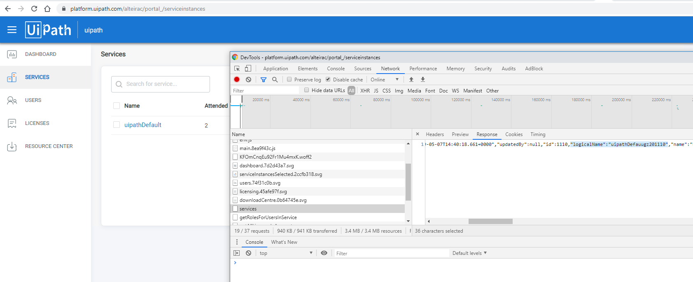

# chabot-uipath-queue-cloud
BETA !! Branched version from UiPath GO to support cloud authentication. (https://go.uipath.com/component/chatbot-with-dialogflow-ai by Quentin Brandon)

dialogflow chatbot adding items in UiPath queue

Set your Cloud credentials:

you'll need your dialogflow client token and your UiPath Cloud information in the config/default.json file:

"cloud":{
		"refreshToken": "aaaaaaaaaaaaaaaaaaaaaaaaa82gK2nrN",
		"serviceInstanceLogicalName": "uipathDefauugz201110",
		"path": "alteirac/uipathDefault"
	},

How to get your serviceInstanceLogicalName:

Navigate to https://platform.uipath.com/

Open your chrome debugger (F12), refresh the page and look for "services" call in the network tab:

update your config/default.json accordingly.
